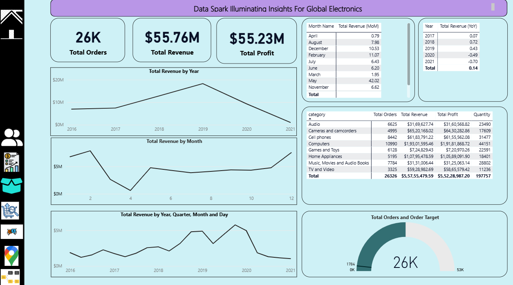
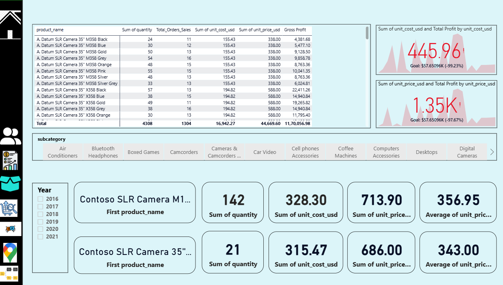
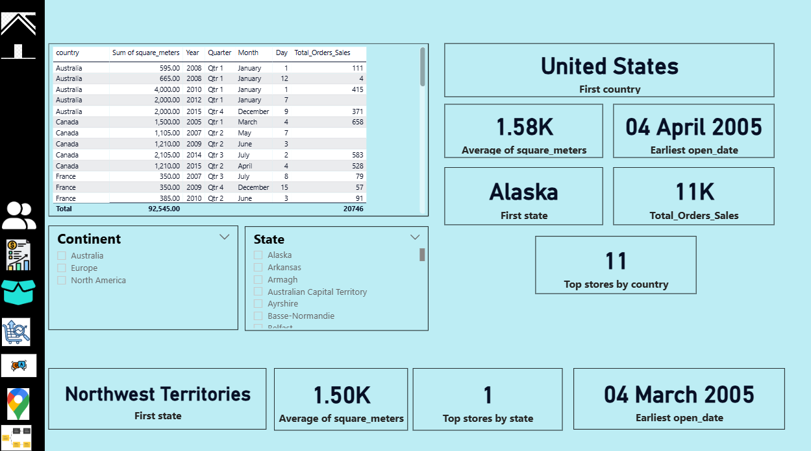
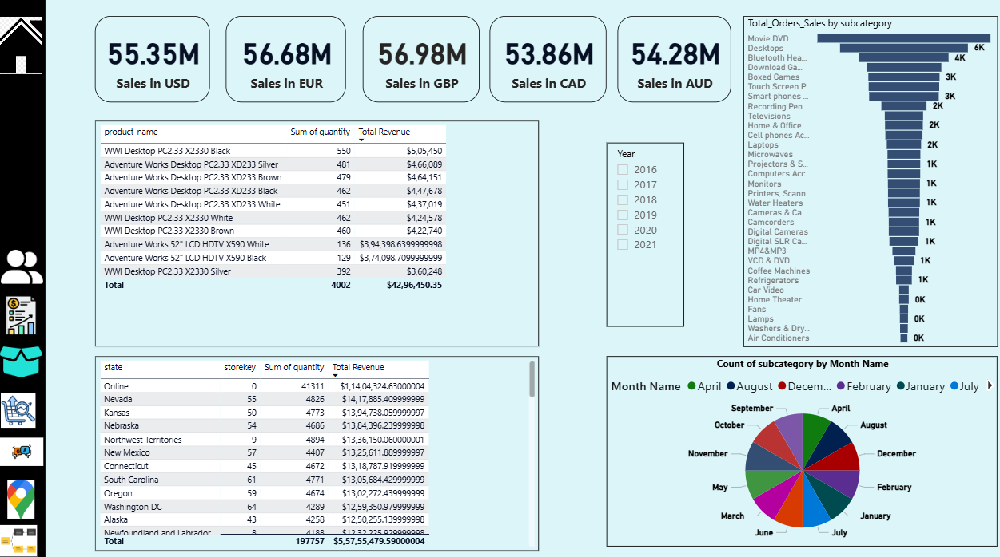
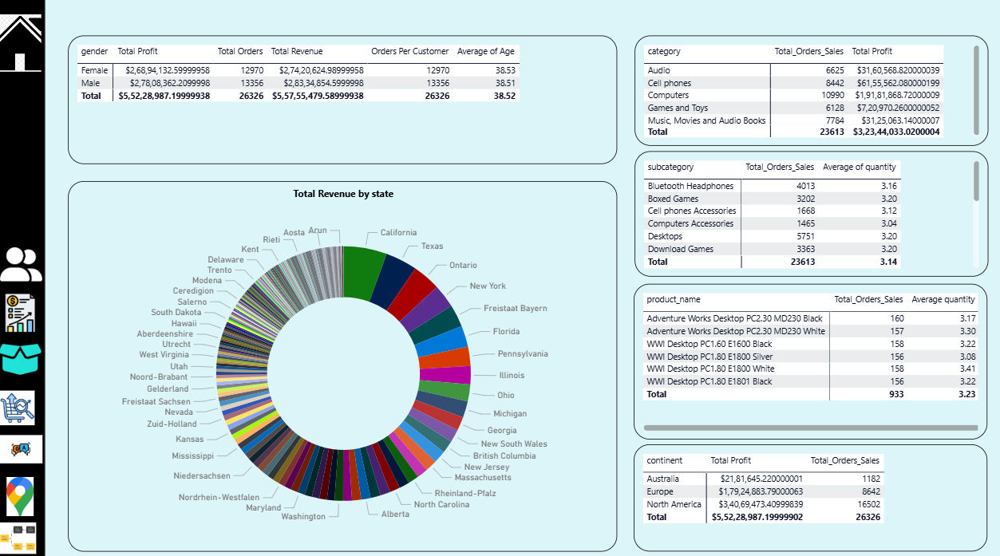

# DataSpark: Illuminating Insights for Global Electronics

## 📌 Project Overview
This project conducts **Exploratory Data Analysis (EDA)** for Global Electronics, a leading consumer electronics retailer, to uncover actionable insights that enhance customer satisfaction, optimize operations, and drive business growth. The analysis spans customer demographics, sales trends, product performance, and store operations.

---

## 🛠 Skills
- **Data Cleaning & Preprocessing**  
- **Exploratory Data Analysis (EDA)**  
- **Python Programming**  
- **SQL Data Management**  
- **Power BI Visualization** 

A set of interactive dashboards and visual analyses for a global electronics dataset.  
This repository contains exported dashboard images that showcase the following analyses:

- **Product Analysis**
- **Store Analysis**
- **Sales Analysis**
- **Customer Analysis**
- **Main Dashboard / Executive Summary**

---

## Dashboards / Images

### Main Dashboard
**Filename:** `Main_Dashboard_DI.png`  

This page gives a high-level business overview for leadership team:

Insights shown:

Total revenue, profit, orders, and growth trends

Top-performing regions and product categories

Quick comparison of store contributions

Business Value:
Helps executives track KPIs and make fast strategic decisions.

---

### Product Analysis
**Filename:** `Product_Analysis_DI.png`  

This focuses on identifying winning and underperforming products:

Insights shown:

Best-selling product categories

Profit contribution by product line

High-demand vs low-selling items

Business Value:
Guides decisions on product optimization, marketing focus, and inventory planning.

---

### Store Analysis
**Filename:** `Store_Analysis_DI.png`  

This page highlights store performance across locations:

Insights shown:

Revenue by region and by store type

Footfall vs. sales correlation

Top and bottom store ranking

Business Value:
Supports store expansion planning and resource allocation to improve underperforming locations.

---

### Sales Analysis
**Filename:** `Sales_Analysis_DI.png`  

Analytical breakdown of overall sales performance:

Insights shown:

Monthly and seasonal trends

Order volume and revenue growth patterns

Contribution of discounts and pricing

Business Value:
Helps forecast demand and shape pricing and promotional strategies.

---

### Customer Analysis
**Filename:** `Customer_Analysis_DI.png`  

Customer behavior and segmentation insights:

Insights shown:

Customer lifetime value segments

New vs returning customers

Purchase patterns by demographics

Business Value:
Strengthens CRM initiatives and targeted marketing campaigns.

---

## What this repo contains

- High-quality dashboard exports (PNG files listed above) created from a Power BI / dashboarding workflow.
- Each image highlights data-driven insights such as revenue trends, product performance, regional sales, customer segmentation, and top storefront metrics.

 

---

## 🎯 Domain
**Retail Analytics in the Electronics Industry**

---

## ❓ Problem Statement
Global Electronics seeks to leverage its customer, product, sales, and store data to:  
1. Improve marketing strategies and customer segmentation.  
2. Optimize inventory management and sales forecasting.  
3. Enhance store performance and international pricing strategies.  

---

## 📊 Business Use Cases
1. **Customer Insights**: Tailor marketing campaigns based on demographics and purchase behavior.  
2. **Product Optimization**: Identify top-performing products and categories.  
3. **Store Expansion**: Evaluate high-performing regions for new stores.  
4. **Currency Impact**: Adjust international pricing using exchange rate analysis.  

---

## 🚀 Approach
### 1. **Data Cleaning & Preparation**
- Handle missing values, convert data types, and merge datasets.
- **Tools**: Python (Pandas, NumPy).

### 2. **SQL Database Integration**
- Create tables and load preprocessed data using SQL.
- **Tools**: PostgreSQL/MySQL.

### 3. **Exploratory Data Analysis (EDA)**
- Analyze customer demographics, sales trends, and product performance.
- **Tools**: Python (Matplotlib, Seaborn).

### 4. **Power BI/Tableau Visualization**
- Connect to SQL database and build interactive dashboards.
- **Tools**: Power BI, Tableau.

### 5. **10 Key SQL Queries**
- Extract insights like top-selling products, customer segmentation, and sales by region.

---

## 📂 Dataset
- **Primary Data**: Customer profiles, product details, sales transactions, store info, and currency exchange rates.  
- **Dataset Names**: [Download Here]Customers.csv  ,Data_Dictionary.csv ,Exchange_Rates.csv,Products.csv,Sales.csv,Stores.csv
- 

---

## 📝 Analysis Steps
### **Customer Analysis**
- Demographic distribution (age, gender, location).  
- Purchase patterns (order value, frequency).  
- Customer segmentation.  

### **Sales Analysis**
- Trends, seasonality, and top-performing products/stores.  
- Currency exchange impact.  

### **Product Analysis**
- Popularity, profitability, and category performance.  

### **Store Analysis**
- Performance metrics (sales/sq. meter, geographical trends).  

---

## 📊 Results & Deliverables
1. **Cleaned and Integrated Datasets**  
2. **EDA Report** with actionable insights.  
3. **Interactive Dashboards** (Power BI/Tableau).  
4. **SQL Queries** for key business questions.  
5. **Recommendations** for marketing, inventory, and expansion.  

---
